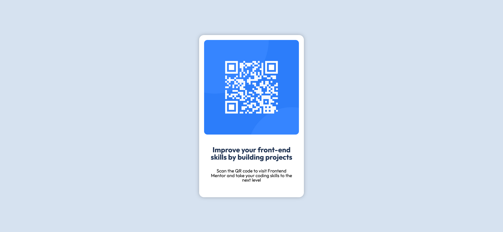

# Frontend Mentor - QR code component solution

This is a solution to the [QR code component challenge on Frontend Mentor](https://www.frontendmentor.io/challenges/qr-code-component-iux_sIO_H). Frontend Mentor challenges help you improve your coding skills by building realistic projects. 

## Table of contents


  - [Screenshot](#screenshot)
  - [Links](#links)

  - [Built with](#built-with)
  - [What I learned](#what-i-learned)
  - [Continued development](#continued-development)
  - [Useful resources](#useful-resources)
- [Author](#author)


### Screenshot





### Links

- Solution URL: (https://github.com/LisFoxG/QR_code_component)


### Built with

- Semantic HTML5 markup
- CSS custom properties
- CSS Grid


### What I learned

I tried to position card in center using display:grid and it worked pretty well


```html
<h1>Some HTML code I'm proud of</h1>
```
```css
.proud-of-this-css {
  color: papayawhip;
}
```
```js
const proudOfThisFunc = () => {
  console.log('🎉')
}
```


### Continued development

Unfortunately i have a bad time understanding all grid properties, so gotta focus on that.


### Useful resources

- (https://www.youtube.com/watch?v=FPL4hnmA84A) - This helped me alot, with basics of grid.

**Note: Delete this note and replace the list above with resources that helped you during the challenge. These could come in handy for anyone viewing your solution or for yourself when you look back on this project in the future.**

## Author


- Frontend Mentor - [@LisFoxG](https://www.frontendmentor.io/profile/LisFoxG)


**Note: Delete this note and add/remove/edit lines above based on what links you'd like to share.**


**Note: Delete this note and edit this section's content as necessary. If you completed this challenge by yourself, feel free to delete this section entirely.**
